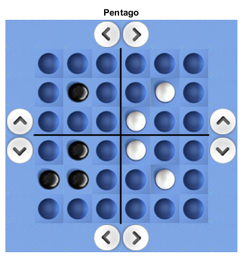
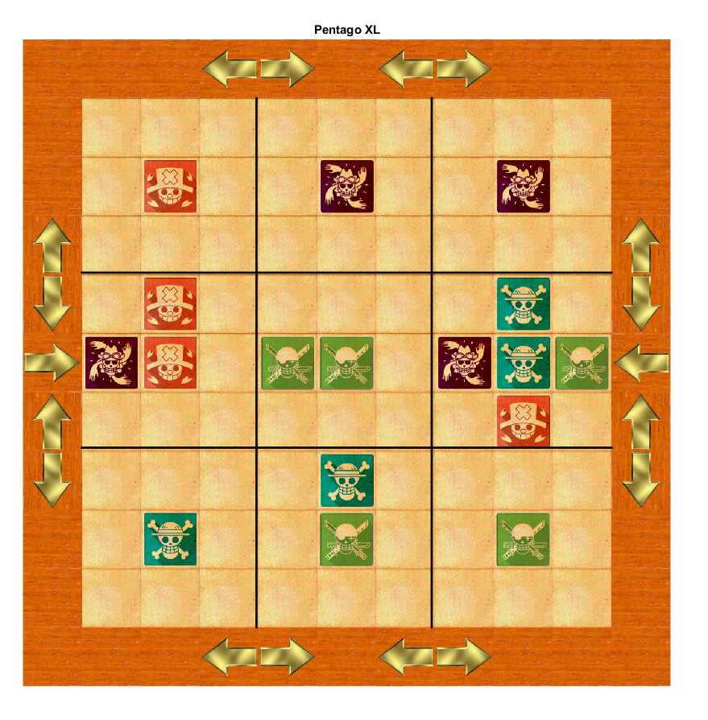

# Pentago

<p align="center">
    
</p>

Pentago is a two-player abstract strategy game invented by Tomas Flodén.

The game is played on a 6×6 board divided into four 3×3 sub-boards (or quadrants). Taking turns, the two players place a marble of their color (either black or white) onto an unoccupied space on the board, and then rotate one of the sub-boards by 90 degrees either clockwise or anti-clockwise. This is optional in the beginning of the game, up until every sub-board no longer has rotational symmetry, at which point it becomes mandatory (this is because until then, a player could rotate an empty sub-board or one with just a marble in the middle, either of which has no real effect). A player wins by getting five of their marbles in a vertical, horizontal or diagonal row (either before or after the sub-board rotation in their move). If all 36 spaces on the board are occupied without a row of five being formed then the game is a draw.

There is also a 3-4 player version called Pentago XL. The board is made of 9 3×3 boards, and there are 4 colours (red, yellow, green and blue) instead of the basic 2.

## Getting Started

These instructions will get you a copy of the project up and running on your local machine for development and testing purposes. See deployment for notes on how to deploy the project on a live system.

### Prerequisites

What things you need in order to launch the Pentago

```
MATLAB 2015a and above
```

## Themes

This Pentago allows the user to change the theme or insert a new theme for the board. There are already 3 themes available by default. 

One Piece                         |  Original Theme
:--------------------------------:|:-------------------------:
  |  

### Pentago XL

The game also has a 9x9 board playing mode which is available for 2 to 4 players gameplay.

<p align="center">
    
</p>

## Built With

* [MATLAB](https://www.mathworks.com/products/matlab.html)


